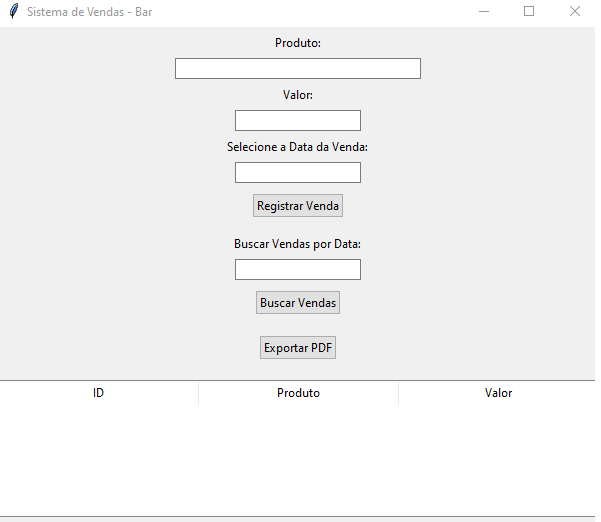

# Sistema de Vendas - Bar

Este é um sistema simples de controle de vendas desenvolvido como um projeto freelancer. O sistema foi feito em Python utilizando `Tkinter` para a interface gráfica e `SQLite` como banco de dados. Ele permite registrar vendas, buscar vendas por data, visualizar as vendas registradas em uma tabela e exportar os dados para um arquivo PDF.

## Funcionalidades

- **Registrar Vendas:** Permite o cadastro de vendas no banco de dados com informações sobre o produto, valor e data da venda.
- **Buscar Vendas por Data:** Permite buscar vendas registradas em uma data específica.
- **Visualizar Vendas:** Exibe uma tabela com todas as vendas registradas, mostrando o ID, produto, valor e data.
- **Exportar para PDF:** Permite exportar todas as vendas registradas para um arquivo PDF formatado.

## Dependências

Este projeto requer as seguintes bibliotecas:

- `tkinter` (para a interface gráfica)
- `sqlite3` (para o banco de dados SQLite)
- `reportlab` (para geração do PDF)

Instale as dependências utilizando `pip`:

```bash
pip install reportlab
```

Nota: tkinter e sqlite3 geralmente já vêm com o Python, então você não precisará instalá-las separadamente.

Como Usar
1. Clone este repositório para o seu computador:
```bash
git clone https://github.com/seuusuario/sistema-de-vendas.git
cd sistema-de-vendas
```

2. Execute o Script:
```bash
python sistema_de_vendas.py
```
3. O sistema abrirá uma interface gráfica onde você poderá:
* Registrar novas vendas.
* Buscar vendas por data.
* Visualizar as vendas em uma tabela.
* Exportar os dados para um arquivo PDF.

Funcionalidades Detalhadas
* Registrar Venda: Ao clicar em "Registrar Venda", o sistema solicita os dados do produto, valor e data. Após o preenchimento e clique no botão, a venda é salva no banco de dados.
* Buscar por Data: Ao digitar uma data no campo de busca e clicar em "Buscar Vendas", o sistema exibirá todas as vendas registradas nessa data específica.
* Tabela de Vendas: Exibe todas as vendas em ordem decrescente de ID. Os dados são exibidos nas colunas ID, Produto, Valor e Data.
* Exportação para PDF: Ao clicar em "Exportar PDF", o sistema criará um arquivo PDF contendo todas as vendas registradas, formatadas e organizadas.

Exemplo de Tela:




